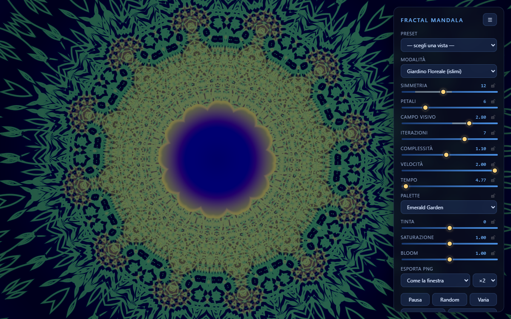
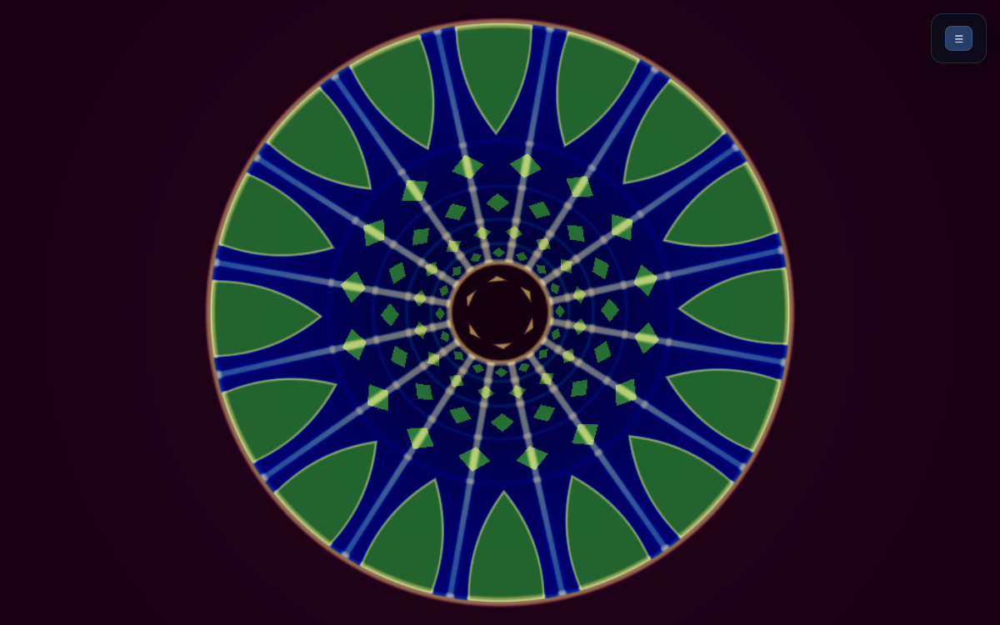
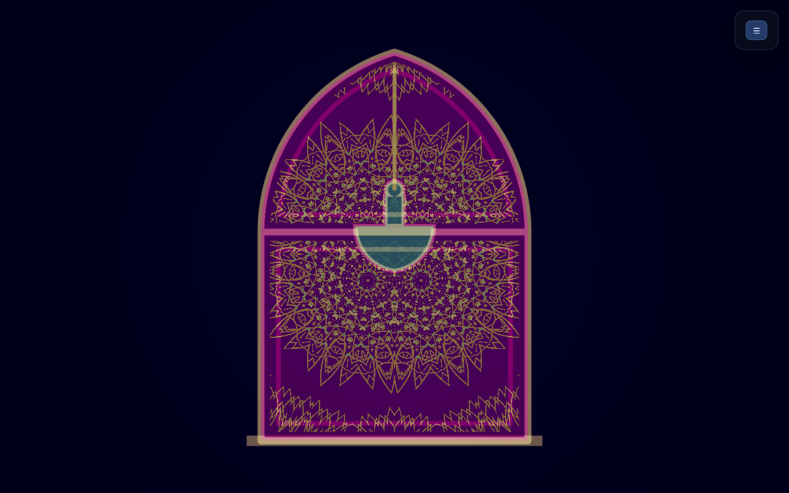
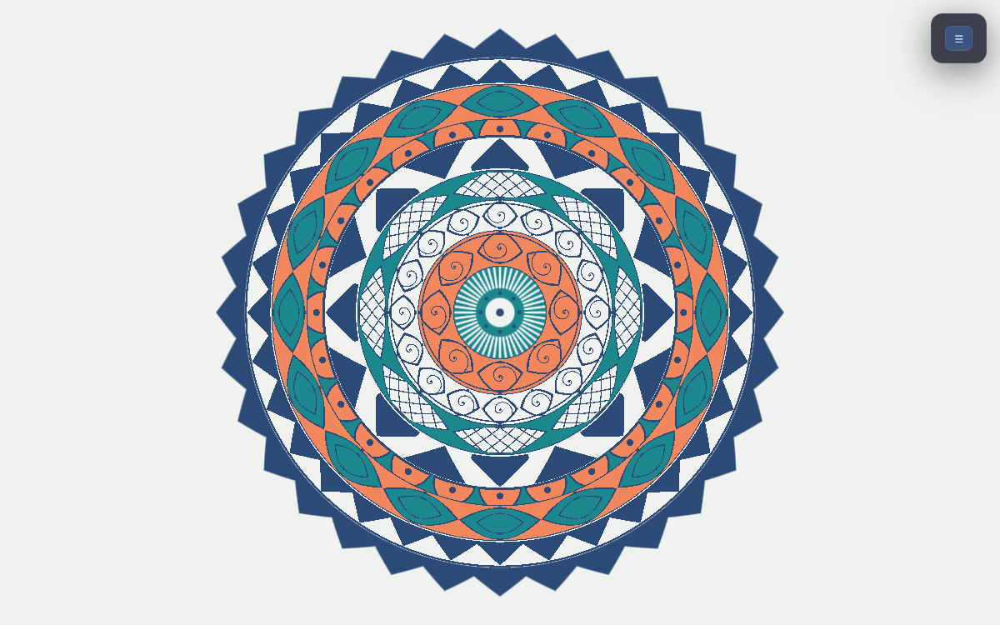
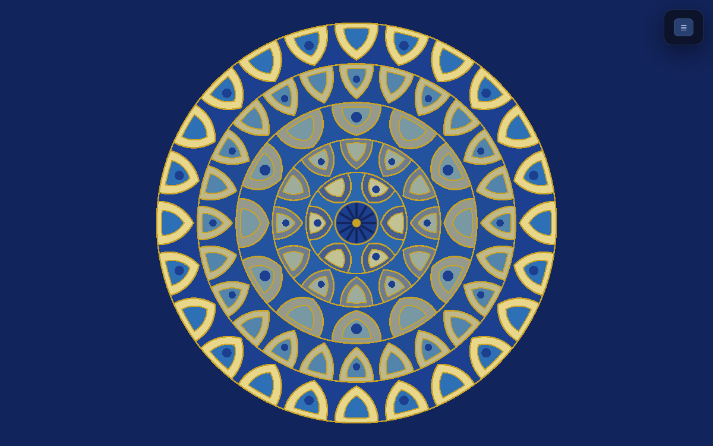
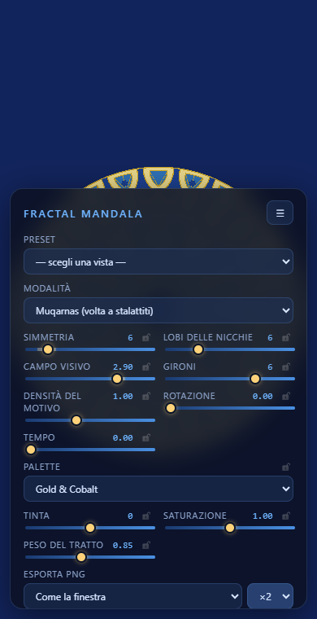

# Fractal Mandala Visualiser

Visualizzatore WebGL di mandala ispirati alla geometria islamica: dieci
modalità di rendering, otto palette, simmetria e iterazioni regolabili dal vivo,
e un permalink nell'URL che descrive per intero la vista che stai guardando.

Live: <https://fractal.77.42.70.26.nip.io>



## Cos'è

Una singola pagina HTML che disegna un fullscreen quad e lascia tutto il lavoro
a un fragment shader GLSL. Niente build step, niente dipendenze, niente backend:
`index.html` più un foglio di stile e tre script. Aprirlo da `file://` funziona
esattamente come servirlo da un web server.

Le dieci modalità:

| # | Modalità | Cosa disegna |
|---|---|---|
| 0 | Kaleido IFS | pieghe caleidoscopiche + inversione sferica (orbit trap) |
| 1 | Giardino Floreale | arabesco islimi: rose SDF annidate con steli ondulati |
| 2 | Girih Stars | tassellatura stellare su anelli radiali, con intreccio |
| 3 | Julia Bloom | insieme di Julia filtrato attraverso il caleidoscopio |
| 4 | Shamsa | medaglione solare: stelle annidate e raggiera |
| 5 | Cupola Spirale | tassellatura a spirale in stile Sheikh Lotfollah |
| 6 | Volta a Spicchi | volta costolonata vista dal basso: costoloni, corsi di losanghe, arcata di archi acuti sul bordo |
| 7 | Mihrab | nicchia ad arco acuto con lampada sospesa e reticolo di viticci islimi |
| 8 | Henna | mandala vettoriale piatto: bande concentriche di motivi disegnati, composte dal seme «petali» |
| 9 | Muqarnas | volta a stalattiti vista dal basso: nicchie ad arco su gironi |

La modalità 7 ha un alto e un basso: come le due modalità a inchiostro parte con
velocità 0, perché la scena ruota lentamente con il tempo e la nicchia si
inclinerebbe. Cambiando modalità dal menu il tempo riparte da zero.

Le modalità 8 e 9 non sono frattali: sono illustrazione. Campiture piatte e un
contorno di spessore costante, senza tonemap né vignette — la 8 dispone corone
concentriche di motivi disegnati; la 9 impila gironi di nicchie ad arco come una
volta a stalattiti vista dal basso. Vanno guardate ferme: nei loro preset la
velocità è 0. In queste due modalità lo slider *bloom* non è un bagliore, è il
peso del tratto.

Nella modalità 8 lo slider **Petali** non conta petali: è il seme del piatto. Da
lì escono la larghezza di ogni corona, quante celle contiene, quale degli otto
motivi le riempie e quale campitura ci sta sotto, quindi ogni valore da 3 a 16
disegna un mandala diverso a parità di simmetria, bande e palette. Anche
`Random` lo cambia, insieme al resto.

Nella modalità 9 lo stesso slider è un numero di lobi: quante scanalature sono
incise nel catino di ogni nicchia, quante punte ha la rosetta di accento sulle
celle alterne e quanti raggi la rosetta al centro della volta.

| | | | |
|---|---|---|---|
|  |  |  |  |
| Volta a Spicchi | Mihrab | Henna | Muqarnas |

## Come si usa

Apri `index.html` nel browser, oppure servi la cartella:

```bash
python -m http.server 5188
# poi http://127.0.0.1:5188
```

Interazione sul canvas:

| Gesto | Effetto |
|---|---|
| trascina | sposta la vista (pan) |
| Shift + trascina | ruota |
| rotella / pinch | zoom ancorato al puntatore |
| doppio click | fullscreen |

Il pannello a destra si apre e chiude col pulsante `☰`. `PNG` esporta l'immagine
alla dimensione scelta nel menu sopra, `Random` genera una combinazione di
parametri, `Varia` ne sposta di poco quelli che hai lasciato liberi, `Centra`
azzera pan e rotazione. La riga sotto — `↶ ↷ A/B ★` — è il banco di
regolazione, più giù.

In cima al pannello c'è **Preset**: una dozzina di viste già composte, una per
modalità più qualche variante. Sceglierne una installa lo stato completo —
modalità, simmetria, palette, inquadratura — e per le modalità animate parte
già a orologio avanzato, perché la 0, la 2, la 3 e la 4 a tempo zero rendono una
macchia quasi piatta e ci metterebbero qualche secondo a diventare quello che il
nome promette. Appena tocchi uno slider il menu torna a `—`: la vista non è più
quel preset.

### Il pannello segue la modalità

Gli slider sono gli stessi per tutte le modalità, ma ognuna li usa a modo suo, e
il pannello lo dice invece di lasciartelo scoprire:

- **I nomi cambiano.** In Henna «Petali» diventa *Seme del piatto*, «Iterazioni»
  diventa *Corone* e «Bloom» *Peso del tratto*; in Muqarnas *Lobi delle nicchie*
  e *Gironi*; nella Cupola *Lobi della rosetta*. Il valore e il permalink non
  cambiano — cambia solo il nome sotto cui lo leggi.
- **Gli slider che quella modalità non legge si spengono**, sbiaditi e non
  trascinabili: «Petali» in Kaleido IFS, Girih, Julia e Shamsa. Il valore resta
  dov'era, e torna vivo appena passi a una modalità che lo usa, così un
  permalink ricevuto da qualcun altro non perde nulla.
- **`Random` pesca dentro la modalità corrente**: iterazioni entro il tetto del
  suo ciclo, inquadratura attorno a quella per cui è tarata, e nessuna velocità
  sulle tre modalità che hanno un alto (Mihrab, Henna, Muqarnas) — girarle
  significherebbe solo vederle storte.

### Il banco di regolazione

Regolare vuol dire provare, e provare vuol dire poter tornare indietro.

- **Annulla e rifai** (`↶ ↷`, oppure `Ctrl+Z` e `Ctrl+Maiusc+Z`) camminano
  sull'intera vista, tempo e colore compresi. Un trascinamento di slider è un
  passo solo, non trecento.
- **A/B** parcheggia la vista corrente; il click dopo alterna fra quella e
  quella nuova, e così via. Due regolazioni vicine non si giudicano a memoria:
  si giudicano alternandole. Da tastiera è `B`; `Maiusc+click` riparcheggia.
- **Il lucchetto** accanto a ogni valore lo mette al riparo da `Random` e
  `Varia`: blocca palette e inquadratura e randomizza solo la geometria. I
  lucchetti restano fra una sessione e l'altra e non finiscono nel permalink —
  sono un modo di lavorare, non parte della vista.
- **`Varia`** (tasto `V`) è il `Random` piccolo: sposta ogni parametro libero di
  poco, così quello che ti piaceva resta riconoscibile.
- **`★`** salva la vista corrente nel menu Preset, sotto «Le tue viste», e resta
  lì fra una sessione e l'altra. `Maiusc+click` cancella quella selezionata.
- **Il numero si può scrivere**: clicca il valore accanto al nome, digitalo,
  Invio. Esc annulla.
- **Doppio click su uno slider** lo riporta al valore che la modalità corrente
  vuole, senza toccare il resto.
- **La banda chiara sulla traccia** è la fascia in cui quella modalità rende:
  un suggerimento, non un limite — gli estremi restano quelli per tutte, perché
  restringerli taglierebbe i valori di un permalink che arriva da altrove.

Due controlli nuovi in fondo alla lista: **Tempo** ferma l'animazione dove
vuoi tu (le modalità 0, 2, 3 e 4 hanno bisogno di qualche secondo prima di
risolvere), e **Tinta** e **Saturazione** ritoccano il colore *dopo* la palette,
in tutte e dieci le modalità. Nelle due a inchiostro la tinta muove anche la
carta: lo stesso piatto su carta calda o fredda sono due poster diversi.

### Esportare un PNG

Il menu **Esporta PNG** decide due cose diverse.

La prima è la dimensione, e non ha niente a che vedere con la finestra: «come la
finestra» scrive quello che vedi, gli altri valori sono il lato lungo del file —
fino a 8192 px — con l'aspetto della finestra conservato. Non è solo un
ingrandimento: le modalità 6 e 7 fanno sparire ogni livello di ricorsione quando
il suo passo scende sotto il pixel, quindi un mihrab a 4096 px ha viticci che
sullo schermo non c'erano.

La seconda è **×1 / ×2 / ×3**, i campioni per pixel: si disegna quel tanto più
grande e si riduce. Sulle modalità a inchiostro cambia poco — quelle hanno già
un antialiasing analitico — ma su Kaleido IFS, Girih e Julia a molte iterazioni
è la differenza fra filamenti continui e una manciata di pixel isolati. Il
valore predefinito è ×2.

Un export grande blocca la pagina per qualche secondo: è normale, e il messaggio
in basso dice a che dimensione sta lavorando. Se la GPU non regge la misura
richiesta, l'app abbassa prima i campioni e poi, solo se serve, la dimensione —
e in quel caso te lo scrive invece di darti un file grande e vuoto.

### Su schermo stretto

Sotto i 620 px di larghezza il pannello diventa un foglio in basso, con gli
slider su due colonne, e **parte chiuso**: si apre col `☰` nell'angolo in basso
a destra, dove arriva il pollice. Con un puntatore grosso (touch) le maniglie
degli slider e i pulsanti crescono.



## Il permalink

Ogni modifica riscrive l'hash dell'URL (con debounce a 250 ms) e lo salva in
`localStorage`. Copiare la barra degli indirizzi condivide la vista esatta.

```
#m=1&s=12&p=6&i=7&z=2.8&c=1.1&v=2&b=1&g=7&t=6&h=0&k=1&x=-0.12&y=0&r=0
```

| Chiave | Significato | Range |
|---|---|---|
| `m` | modalità | 0–9 |
| `s` | simmetria (ordine del caleidoscopio) | 3–24 |
| `p` | petali; nella modalità 8 è il seme che sceglie la composizione | 3–16 |
| `i` | iterazioni | 1–14, con un massimo per modalità |
| `z` | campo visivo | 0.2–8 — **più alto = più largo**, più basso = zoom profondo |
| `c` | complessità (fattore di scala per iterazione) | 0.50–1.80 |
| `v` | velocità dell'animazione | 0–2 |
| `b` | bloom, ovvero il peso del tratto nelle modalità 8 e 9 | 0–2 |
| `g` | palette | 0–7 |
| `t` | l'istante dell'animazione, in secondi | 0–300 sullo slider, oltre solo dall'URL |
| `h` | tinta, in gradi | −180–180 |
| `k` | saturazione | 0–2 |
| `x`, `y` | pan, in unità di schermo | — |
| `r` | rotazione, in radianti | — |

`t` è ciò che rende condivisibile una modalità animata: senza, chi apre il tuo
link vede il secondo zero, che per le modalità 0, 2, 3 e 4 è una macchia quasi
piatta. L'hash si riscrive quando fai qualcosa — muovere uno slider, mettere in
pausa — non a ogni fotogramma, quindi «metti in pausa e copia» è il modo di
condividere l'istante esatto.

Un permalink più vecchio di queste tre chiavi resta valido: `t`, `h` e `k`
tornano ai loro valori neutri (0, 0, 1) invece di ereditare quelli della vista
che stavi guardando, così rende come rendeva.

All'avvio l'hash esplicito vince sull'ultima sessione salvata. Se `localStorage`
non è disponibile (finestra privata, sandbox) resta l'URL come sola fonte.

## Screenshot

Ci sono due suite, entrambe per
[screenshot-kit](file:///C:/Personal_utilities/screenshot-kit) e da lanciare
dalla radice del repo.

La suite di lavoro, tredici inquadrature ad alta risoluzione per controllare a
vista una modifica:

```bash
node C:/Personal_utilities/screenshot-kit/shotkit.mjs --serve
```

Finisce in `.shots/`, che è in `.gitignore`: quelle immagini non si versionano.

Le sei immagini che questo README mostra sono invece versionate, in
[screenshots/](screenshots/), così la pagina si legge su GitHub e sulla copia
pubblicata senza dover catturare niente:

```bash
node C:/Personal_utilities/screenshot-kit/shotkit.mjs --config shotkit.readme.mjs --serve
```

Le due suite non si duplicano: `shotkit.readme.mjs` prende le inquadrature da
`shotkit.config.mjs` e le rinomina, cambiando solo la risoluzione (1200×750 a
scala 1, perché queste entrano nella storia di git e non ne escono più).
L'unico scatto suo è quello del pannello su schermo stretto.

## Deploy

Sito statico dietro l'nginx condiviso, configurato in [.deploy/](.deploy/):
nessun build sul server, il checkout è montato in sola lettura, quindi un
rollback è un `git checkout` del commit precedente.

## Compatibilità

Serve WebGL 1. `OES_standard_derivatives` è opzionale: se manca, l'anti-aliasing
usa una soglia fissa al posto di `fwidth()` e la pagina lo segnala. La perdita di
contesto WebGL è gestita: il programma viene ricompilato al ripristino.

## Licenza

[MIT](LICENSE), © Noein Solutions. Usa, modifica e ridistribuisci liberamente,
anche in un prodotto commerciale, tenendo l'avviso di copyright.
